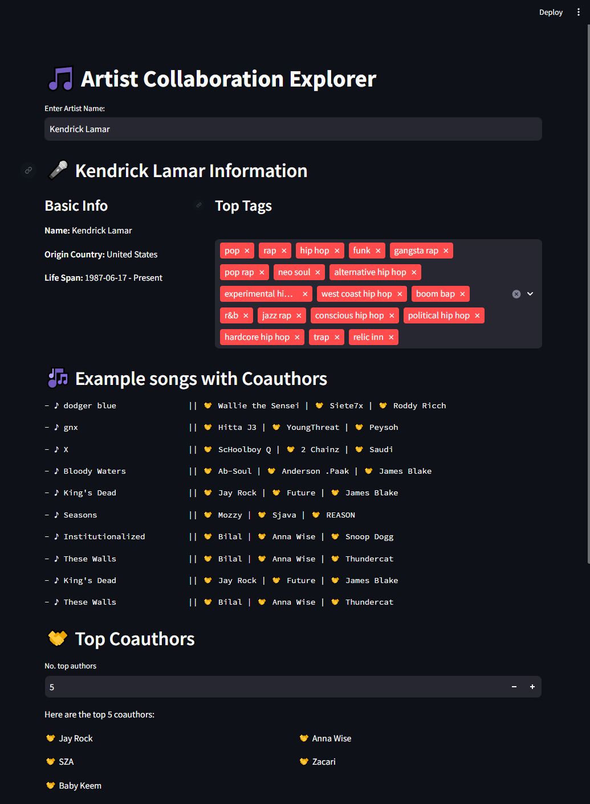
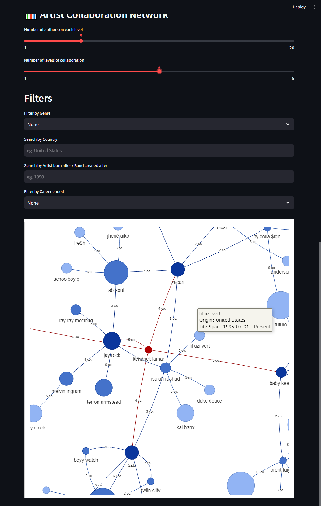
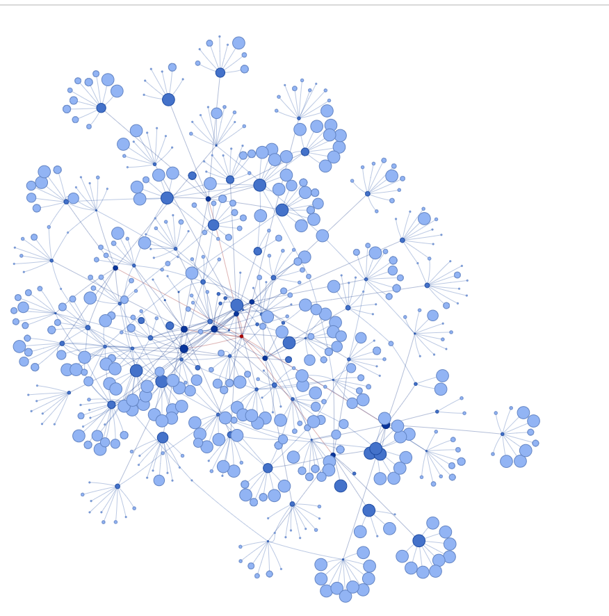

# 🎵 Artist Collaboration Explorer

The **Artist Collaboration Explorer** is a Streamlit-based web application designed to visualize the collaboration network of musical artists. Through an interactive graph, users can explore connections between artists, discover top coauthors, and analyze relationships across genres, countries, and time periods.

<div style="display: flex; justify-content: center;">
  <div style="margin-right: 20px;">
    
  </div>
  <div>
    
  </div>
</div>

<p align="center">
  
</p>  

## Features

- **Artist Information:**  
  View basic details about any artist, including their origin, life span, and top tags.

- **Top Coauthors:**  
  Discover the most frequent collaborators of an artist and their contributions.

- **Song Collaboration List:**  
  Explore specific songs and their coauthors, sorted by the number of collaborations.

- **Interactive Network Graph:**  
  Visualize artist collaborations with customizable levels and filters for genres, countries, and career timelines.

- **Filters:**  
  Refine results based on:
  - Genre
  - Country of origin
  - Career start year
  - Career status (active/inactive)

---

## How to Run

1. Clone the repository:
   ```bash
   git clone <repository-url>
   cd <repository-folder>
   ```

2. Install dependencies:

    ```bash
    pip install -r requirements.txt

3. Run the Streamlit app:


    ```bash
    streamlit run app.py

4. Open the app in your browser at provided address.

## Example Usage

- Enter the name of an artist (e.g., Kendrick Lamar) in the input field.
- View the artist's basic details and top tags.
- Browse their top coauthors and example songs with collaborators.
- Generate an interactive graph to explore collaboration levels.